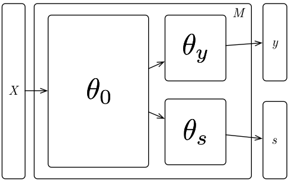

# fair-networks

**Note**: use

```bash
 pandoc README.md -o README.pdf
```

to generate a PDF rendering this file (or open it in Atom and preview the markdown using the plugin `markdown-preview-plus`).

## A fair-network model

Let us consider a matrix $X \in \mathbb{R}^{n \times m}$, and two vectors $\vec{y} \in \mathbb{R}^n$ and $\vec{g} \in \mathbb{R}^n$. We consider the problem of building a model $M$ such that $M(X) \simeq \vec{y}$, with the constraint that model $M$ does not use any information useful to predict $\vec{g}$.

Let us then consider the network architecture shown below:



The idea is to:

1. train N,y-predictor, g-predictor so to optimize the predictions about $y$ and $g$. In this phase the network strives to predict $g$ as well as possible.
2. we want now to tweak things so that g-predictor cannot predict $g$ any more. To do so, we tweak N weights so to maintain high accuracy on $y$ while making g-predictor to be indistinguishable from a random guess.
3. now we want to give a chance to $g-predictor$ to exploit the remaining information in $N$ to predict $g$ so we re-train only y-predictor and g-predictor and in both cases we try to maximizes the performances.
4. we repeat 2 and 3 until step-3 is unable to find a good predictor for $g$.

**NOTE -- TO BE EXPANDED**: probably in step 1 we do not need to train the network also to predict g, we might just attach $g-predictor$ after the fact. Yet, I don't know if this might be detrimental to our argument that the final network does not use any $g$ information... If we leave it as it is we might argue that the initial network did try to use information about $g$ and then we remove it all... I'm really too tired to think it through though, it really seems that it should not make any difference and this second way may:

  - lead to a better prediction on $g$;
  - make our approach more general (we might apply it to any pre-trained network
**NOTE END**

Upon convergence we conclude that:

- there is enough information on the last layer of $N$ to predict $g$;
- if $y$ is still good enough, we obtained a classifier whose prediction does not depend on $g$ nor any information about $g$ that can be reconstructed from $X$.

Cheers
